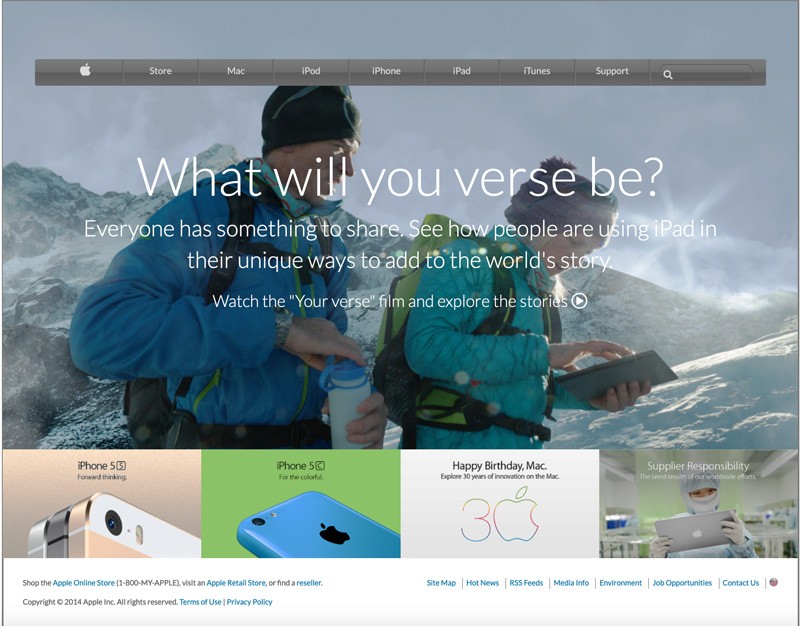

# 2014 APPLE'S WEBSITE WEBPAGE CLONE

The goal of this project is to make a clone of an old version of the Apple website webpage (2014).

> This project helps me master the concept of using images as a background and adding gradints to elements.
> I learned to sized and position the page using correct semantic HTML elements appropriately.
> Correctly setting up navigation bar.



This project covers the following HTML and CSS3 concepts

- Using images as a background
- Adding gradients to elements
- Floats and positioning
- Flex and Grid

## Built With

- HTML
- CSS
- Google fonts
- Font Awesome

## Live Demo

[Live Demo Link](https://acushlakoncept.github.io/old_version_apple/)

## Getting Started

To get a local copy of the repository please run the following commands on your terminal:

```
$ cd <folder>
```

```
$ git clone https://github.com/acushlakoncept/old_version_apple.git
```

## Authors

**Uduak Essien**

- Github: [@acushlakoncept](https://github.com/acushlakoncept/)
- Twitter: [@acushlakoncept](https://twitter.com/acushlakoncept)
- Linkedin: [acushlakoncept](https://www.linkedin.com/in/acushlakoncept/)

## 🤝 Contributing

Contributions, issues and feature requests are welcome!

Feel free to check the [issues page](https://github.com/acushlakoncept/old_version_apple/issues).

## Show your support

Give a ⭐️ if you like this project!

## Acknowledgments

- Project originally taken from The Odin Project
- Project inspired by Microverse Program
